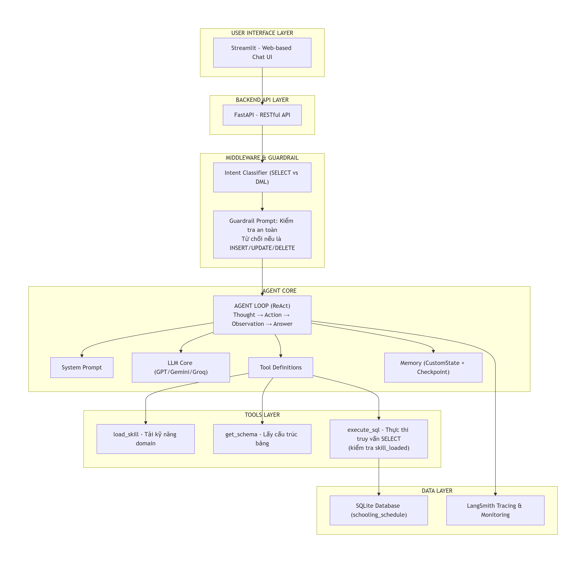
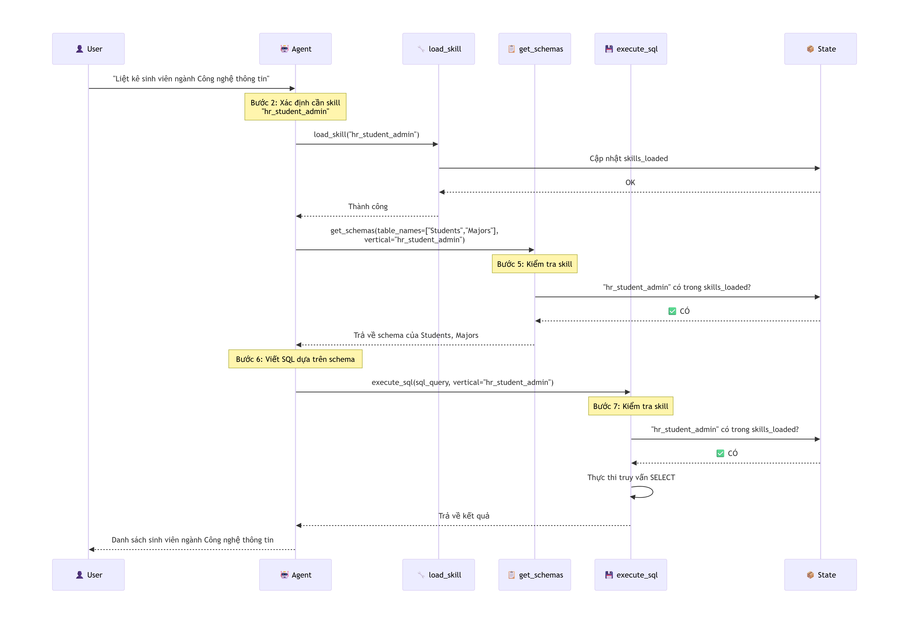

# 🕷️ Spider Agent - AI-powered Database Query Assistant

[](https://www.python.org/downloads/)
[](https://fastapi.tiangolo.com/)
[](https://streamlit.io/)
[](https://www.langchain.com/langsmith)

**Spider Agent** là một trợ lý AI thông minh cho phép người dùng **truy vấn cơ sở dữ liệu bằng ngôn ngữ tự nhiên**. Với kiến trúc Agent ReAct và cơ chế bảo vệ Guardrail, hệ thống tự động chuyển đổi câu hỏi thành truy vấn SQL an toàn (CHỈ SELECT) và trả về kết quả trực quan.

---

## 🏗️ Kiến trúc tổng thể

Hệ thống được xây dựng theo kiến trúc phân lớp rõ ràng, từ giao diện người dùng đến xử lý dữ liệu:


*Hình 1: Kiến trúc phân lớp của Spider Agent*

### Các thành phần chính:

#### 🖥️ **USER INTERFACE LAYER**
- **Streamlit** - Web-based Chat UI

#### 🔌 **BACKEND API LAYER**
- **FastAPI** - RESTful API

#### 🛡️ **MIDDLEWARE & GUARDRAIL**
- **Intent Classifier** - Phân loại ý đồ truy vấn (SELECT vs DML)
- **Guardrail Prompt** - Kiểm tra an toàn, tự động từ chối nếu là INSERT/UPDATE/DELETE

#### 🧠 **AGENT CORE**
- **Agent Loop (ReAct)** - Vòng lặp Thought → Action → Observation → Answer
- **LLM Core Tool Definitions** - Định nghĩa công cụ cho Agent
- **System Prompt** - Hướng dẫn hành vi Agent
- **Hỗ trợ đa nền tảng** - GPT / Gemini / Groq

#### 🛠️ **TOOLS LAYER**
- **execute_sql** - Thực thi truy vấn SELECT (có kiểm tra `skill_loaded`)
- **load_skill** - Tải kỹ năng theo domain chuyên biệt
- **get_schema** - Lấy cấu trúc bảng dữ liệu

#### 💾 **DATA LAYER**
- **SQLite Database** (schooling_schedule)
- **LangSmith Tracing & Monitoring** - Giám sát toàn bộ hoạt động

---

## 🎯 Skill-based Architecture: Human-in-the-Loop

Một trong những tính năng quan trọng nhất là cơ chế **load skill** - cho phép Agent tải kỹ năng theo domain trước khi thực thi truy vấn:


*Hình 3: Quy trình load skill và thực thi truy vấn có kiểm soát*

```

### Tại sao cần cơ chế Load Skill?

- 🔐 **Bảo mật dữ liệu** - Chỉ cho phép truy cập domain đã được cấp phép
- 🎯 **Định tuyến chính xác** - Mỗi skill có bộ schema và quy tắc riêng
- 📊 **Quản lý quyền** - Kiểm soát vertical data (hr_student_admin, finance, sales,...)
- 🔄 **Tái sử dụng** - Skill có thể được dùng lại cho nhiều truy vấn

---

## ✨ Tính năng chính

### 🤖 Đa nền tảng AI
- Hỗ trợ **GPT, Gemini, Groq** - Dễ dàng chuyển đổi giữa các LLM

### 🛡️ Bảo vệ thông minh (Guardrail)
- **Intent Classifier**: Tự động nhận diện SELECT vs INSERT/UPDATE/DELETE
- **Guardrail Prompt**: Từ chối ngay các truy vấn DML
- **Skill-based Access**: Chỉ thực thi khi đã load đúng skill

### 🧠 Agent ReAct
- Vòng lặp **Thought → Action → Observation → Answer**
- Bộ nhớ trạng thái (CustomState + Checkpoint)
- Streaming response theo thời gian thực

### 💬 Giao diện chat thân thiện
- Web-based UI với **Streamlit**
- Hiển thị kết quả dạng bảng trực quan
- Lưu trữ lịch sử hội thoại

### 🛠️ Hệ thống Tools linh hoạt
| Tool | Chức năng | Kiểm tra an toàn |
|------|-----------|------------------|
| `load_skill(skill_name)` | Tải kỹ năng domain | Kiểm tra tồn tại của skill |
| `get_schema(tables, vertical)` | Lấy cấu trúc bảng | Xác thực vertical |
| `execute_sql(query, vertical)` | Thực thi SELECT | Kiểm tra skill_loaded |

### 📊 Giám sát toàn diện
- **LangSmith Tracing** - Log chi tiết từng bước của Agent
- Debug dễ dàng với trace visualization
- Theo dõi performance và chi phí LLM

```

### Các bước cài đặt

```bash
# 1. Clone repository
git clone https://github.com/gilchea/spider-agent.git
cd spider-agent

# 2. Tạo môi trường ảo (khuyến nghị)
python -m venv venv
source venv/bin/activate  # Linux/Mac
# venv\Scripts\activate   # Windows

# 3. Cài đặt dependencies
pip install -r requirements.txt

# 4. Cấu hình biến môi trường
# Tạo file .env với nội dung:
OPENAI_API_KEY=your_key_here
GROQ_API_KEY=your_key_here
GOOGLE_API_KEY=your_key_here
LANGCHAIN_API_KEY=your_key_here
LANGCHAIN_PROJECT=spider-agent

# 5. Chạy ứng dụng
# Option A: Chạy UI
streamlit run app.py

# Option B: Chạy API server
uvicorn main:app --reload --host 0.0.0.0 --port 8000
```

---


## 📁 Cấu trúc thư mục dự án

```
spider-agent/
├── assets/
│   ├── achitecture.png      # Kiến trúc hệ thống
│   ├── database.png          # Sơ đồ database
│   └── skill_first.png       # Quy trình load skill
├── src/                      # Source code chính
│   ├── agent/                # Agent core logic
│   ├── tools/                # Tool definitions
│   ├── middleware/           # Guardrail & intent classifier
│   └── models/               # Database models
├── resource/
│   └── databases/
│       └── schooling_schedule.db  # SQLite database
├── main.py                   # API entry point
├── app.py                    # Streamlit UI
├── requirements.txt          # Dependencies
└── .env                      # Environment variables
```

